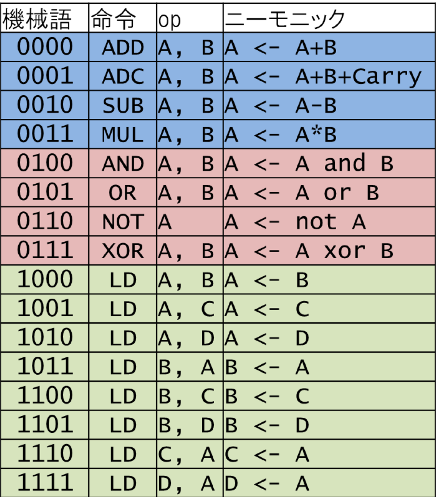

# cpu_comb

## 概要

機械語命令(op)からALUを用いるかを選択し、ALUに命令を出す。

機械語命令からAout, Bout, Cout, Doutに何を出力するかの選択命令をそれぞれ出す。



## 引数

### input

- [3:0] op
- [7:0] Ain
- [7:0] Bin
- [7:0] Cin
- [7:0] Din
- Carryin

### output

- [7:0] Aout
- [7:0] Bout
- [7:0] Cout
- [7:0] Dout
- Carryout

## 依存

- alu_op44
- mux3
- mux4
- op_decode

## Code

```verilog
module cpu_comb(
    input [3:0] op,
    input [7:0] Ain,
    input [7:0] Bin,
    input [7:0] Cin,
    input [7:0] Din,
    input Carryin,
    output [7:0] Aout,
    output [7:0] Bout,
    output [7:0] Cout,
    output [7:0] Dout,
    output Carryout
    );
    
    wire [2:0] op_sel;
    wire [1:0] reg_sel4, reg_sel3;
    wire [7:0] alu_out;
    
    op_decode decoder(op, op_sel, reg_sel4, reg_sel3);
    
    alu_op44 alu(Ain, Bin, Carryin, op_sel, Carryout, alu_out);
    
    mux4 mux4(alu_out, Bin, Cin, Din, reg_sel4, Aout);
    mux3 mux3(Ain, Cin, Din, reg_sel3, Bout);
    
    assign Cout = op == 0'b1110 ? Ain : 8'hxx;
    assign Dout = op == 0'b1111 ? Ain : 8'hxx;
    
endmodule
```

## Test

```verilog
module cpu_comb_tb;

    reg assertion;
    
    reg [3:0] op;
    reg [7:0] Ain, Bin, Cin, Din;
    reg Carryin;
    
    wire [7:0] Aout, Bout, Cout, Dout;
    wire Carryout;
    
    cpu_comb uut (
        .op(op),
        .Ain(Ain),
        .Bin(Bin),
        .Cin(Cin),
        .Din(Din),
        .Carryin(Carryin),
        .Aout(Aout),
        .Bout(Bout),
        .Cout(Cout),
        .Dout(Dout),
        .Carryout(Carryout)
    );
    
    initial begin
        assertion = 1;
        
        // ALU 0001 A <- A + B + Carry
        op = 4'b0001; Ain = 8'h01; Bin = 8'h02; Cin = 8'h03; Din = 8'h04; Carryin = 1;
        #1; assertion = (Aout == 8'h04)  && (Carryout == 0); #10;
        
        // ALU 0111 A <- A xor B
        op = 4'b0111; Ain = 8'h01; Bin = 8'h02; Cin = 8'h03; Din = 8'h04; Carryin = 1;
        #1; assertion = Aout == 8'h03; #10;
        
        // LD 1000 A <- B
        op = 4'b1000; Ain = 8'h01; Bin = 8'h02; Cin = 8'h03; Din = 8'h04; Carryin = 1;
        #1; assertion = Aout == 8'h02; #10;
        
        // LD 1101 B <- D
        op = 4'b1101; Ain = 8'h01; Bin = 8'h02; Cin = 8'h03; Din = 8'h04; Carryin = 1;
        #1; assertion = Bout == 8'h04; #10;
        
        // LD 1110 C <- A
        op = 4'b1110; Ain = 8'h01; Bin = 8'h02; Cin = 8'h03; Din = 8'h04; Carryin = 1;
        #1; assertion = Cout == 8'h01; #10;
        
        // LD 1110 D <- A
        op = 4'b1111; Ain = 8'h01; Bin = 8'h02; Cin = 8'h03; Din = 8'h04; Carryin = 1;
        #1; assertion = Dout == 8'h01; #10;
        
        $finish;
    end
endmodule
```
